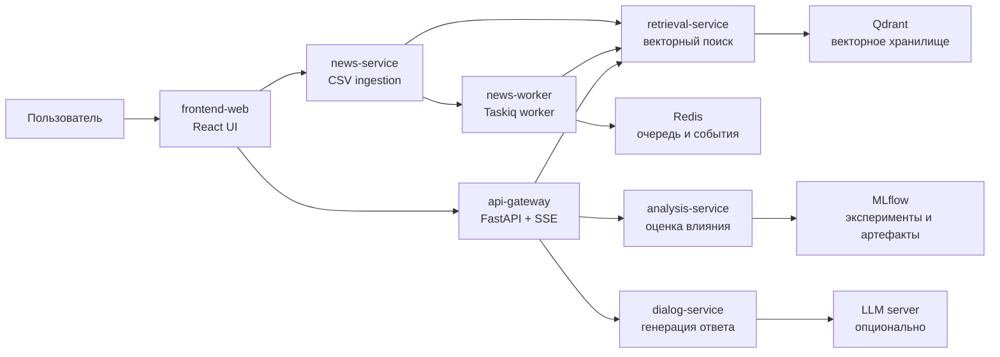

# Архитектура проекта

## Назначение системы

Проект реализует автоматическую диалоговую систему для анализа экономических
новостей. Пользователь задает вопрос в веб-интерфейсе, система находит
релевантные новости, оценивает их экономическое влияние и формирует ответ с
перечнем использованных источников.

Система сделана как локальный микросервисный стенд, чтобы ее можно было
запустить и продемонстрировать на защите курсовой работы без внешней
инфраструктуры.

## Общая схема

## Сервисы

| Компонент | Порт | Назначение |
| --- | ---: | --- |
| `frontend-web` | `5173` | Русскоязычный веб-интерфейс чата, предпросмотра CSV и отображения источников. |
| `api-gateway` | `8000` | Единая точка входа для chat flow. Оркестрирует поиск, анализ и генерацию ответа, отдает SSE-события. |
| `analysis-service` | `8001` | Классифицирует влияние новости как `positive`, `negative` или `neutral`; возвращает русское объяснение. |
| `retrieval-service` | `8002` | Индексирует новости и выполняет векторный поиск по Qdrant. |
| `dialog-service` | `8003` | Формирует финальный ответ. Поддерживает `template` режим и опциональный `llm` режим. |
| `news-service` | `8004` | Читает локальный CSV dataset, показывает preview и отправляет новости на индексацию. |
| `news-worker` | нет | Выполняет фоновые задачи индексации через Taskiq и Redis. |
| `Redis` | `6379` | Очередь Taskiq и канал событий FastStream. |
| `Qdrant` | `6333` | Векторное хранилище для retrieval. |
| `PostgreSQL` | `5432` | Единая реляционная БД стенда; заложена для расширения persistence-сценариев. |
| `MLflow` | `5000` | Локальный интерфейс для ML-экспериментов и артефактов. |

## Data Flow

1. Пользователь открывает `frontend-web` и при необходимости нажимает
   `Предпросмотр CSV`.
2. `frontend-web` запрашивает `news-service`, который читает
   `data/raw/economic_news.csv`.
3. Пользователь нажимает `Индексировать CSV`.
4. `news-service` отправляет документы в `retrieval-service`, а тот сохраняет
   векторы и metadata в Qdrant.
5. Пользователь задает вопрос в чате.
6. `frontend-web` отправляет запрос в `api-gateway` на
   `POST /api/v1/chat/stream`.
7. `api-gateway` отдает SSE-события этапов: старт чата, поиск источников,
   анализ, генерация ответа и завершение.
8. `api-gateway` получает релевантные новости из `retrieval-service`.
9. Для каждой найденной новости `api-gateway` вызывает `analysis-service`.
10. `api-gateway` передает вопрос, источники и результаты анализа в
    `dialog-service`.
11. `dialog-service` возвращает ответ; frontend показывает ответ, источники,
    релевантность и влияние.

## Слоистая архитектура и DDD

Backend-сервисы разделены на слои:

- `domain` — доменные модели, value objects и доменные ошибки;
- `application` — use cases и `Protocol`-интерфейсы портов;
- `infrastructure` — адаптеры к Qdrant, HTTP-клиентам, ML-моделям, Redis;
- `presentation` — FastAPI routers, SSE formatting и mapping ошибок;
- `main` — настройки, dependency injection через Dishka и сборка приложения.

Такое разделение позволяет менять инфраструктуру без переписывания доменной
логики. Например, `dialog-service` может работать через template generator или
через внешний LLM server, а `retrieval-service` может использовать статические
embeddings для demo или FastEmbed в более реалистичном режиме.

## Режимы работы

### Режим анализа

В UI можно выбрать модель анализа:

- `tfidf-logreg` — основной стабильный demo-режим;
- `embedding-logreg` — предусмотренный режим для модели на embedding-признаках;
- `tiny-transformer-classifier` — предусмотренный режим для легкой transformer-модели.

Для локальной защиты рекомендуется `tfidf-logreg`, потому что он гарантированно
работает в compose-стенде.

### Режим генерации ответа

`dialog-service` поддерживает два режима:

- `template` — детерминированный локальный режим без внешней LLM;
- `llm` — режим OpenAI-compatible chat completions через локальный сервер,
  например `llama.cpp`.

По умолчанию Docker Compose запускает `template`, чтобы демонстрация не зависела
от скачивания и запуска большой модели.

## Почему архитектура соответствует теме курсовой

Тема: «Разработка автоматической диалоговой системы на основе языковой модели
для анализа экономических новостей».

Соответствие:

- есть автоматический диалоговый интерфейс;
- есть retrieval pipeline по экономическим новостям;
- есть анализ влияния найденных новостей;
- есть генерация ответа на основе найденного контекста;
- есть LLM-адаптер для подключения языковой модели;
- есть воспроизводимый demo dataset и сценарий проверки;
- архитектура реализована современным микросервисным подходом.

## Что показывать на защите

1. Архитектурную схему сервисов.
2. Запуск `just demo-up`.
3. Проверку `just demo-smoke`.
4. UI на `http://localhost:5173`.
5. Предпросмотр и индексацию CSV.
6. Вопрос в чате и поток событий обработки.
7. Ответ с источниками и оценкой влияния.
