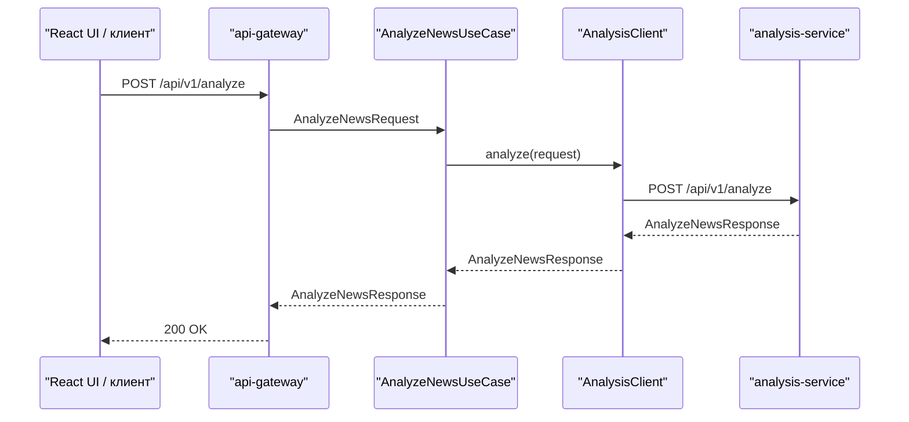

# Интеграция API Gateway с Analysis Service

Дата: 2026-04-29

## Цель

Добавить в `api-gateway` пользовательский HTTP-сценарий анализа экономической новости без переноса ML-логики в gateway. Gateway должен принять запрос от клиента, валидировать его общим контрактом и передать в `analysis-service`, который уже владеет классификацией влияния новости.

## Контекст

Сейчас `api-gateway` содержит только технический endpoint `/api/v1/version`. `analysis-service` уже реализует `POST /api/v1/analyze`, использует контракты из `packages/contracts` и доступен в Docker Compose как сервис `analysis-service` на внутреннем порту `8000`.

Проект придерживается микросервисной архитектуры, DDD, слоистой структуры, Dishka для DI и Protocol-интерфейсов для портов. Интеграция должна сохранить эти границы.

## Выбранный подход

`api-gateway` добавляет endpoint `POST /api/v1/analyze` и вызывает `analysis-service` через application port `AnalysisClient`.

HTTP-реализация клиента живет в infrastructure-слое и использует Zapros как выбранный фреймворк для межсервисных HTTP-клиентов. Если API Zapros потребует минимальной адаптации, она остается внутри infrastructure-слоя и не протекает в application или presentation.

Этот подход выбран, потому что:

- gateway остается тонким входным слоем;
- ML-логика не дублируется между сервисами;
- межсервисный вызов можно тестировать через fake-реализацию `AnalysisClient`;
- структура соответствует DDD и текущему стилю проекта.

## Изменения в компонентах

### Application

Добавить:

- `AnalysisClient` Protocol с методом анализа новости;
- `AnalyzeNewsUseCase`, который принимает `AnalyzeNewsRequest` и возвращает `AnalyzeNewsResponse`;
- доменную или application-ошибку недоступности analysis-сервиса, если инфраструктурный клиент не смог получить корректный ответ.

Use case не должен знать про URL, HTTP, Zapros или FastAPI.

### Infrastructure

Добавить HTTP-клиент analysis-сервиса.

Ответственность клиента:

- отправить `AnalyzeNewsRequest` на `POST /api/v1/analyze`;
- разобрать `AnalyzeNewsResponse`;
- преобразовать сетевые ошибки, timeout и 5xx в ошибку недоступности сервиса;
- не менять смысл бизнес-ответа analysis-сервиса.

### Main

Расширить `ApiGatewaySettings`:

- `analysis_service_url`, по умолчанию `http://analysis-service:8000` для контейнерного запуска;
- timeout межсервисного вызова, по умолчанию короткий и понятный для локальной разработки.

Зарегистрировать через Dishka:

- настройки;
- HTTP-клиент;
- use case.

### Presentation

Добавить route:

```http
POST /api/v1/analyze
```

Тело запроса и ответа используют существующие модели:

- `AnalyzeNewsRequest`;
- `AnalyzeNewsResponse`.

Если analysis-сервис недоступен, gateway возвращает `503 Service Unavailable` с коротким сообщением. Ошибки валидации запроса остаются стандартными FastAPI/Pydantic `422`.

### Deploy

В `deploy/compose.yaml`:

- добавить `API_GATEWAY_ANALYSIS_SERVICE_URL=http://analysis-service:8000`;
- добавить зависимость `api-gateway` от `analysis-service`.

Публичный порт analysis-сервиса `8001:8000` остается удобным для прямой локальной проверки, но основной пользовательский путь идет через gateway.

## Поток данных



## Ошибки

Gateway не скрывает ошибки пользовательского ввода: пустой текст и неизвестная модель остаются `422`.

Gateway скрывает технические детали межсервисного вызова: timeout, невозможность подключиться и 5xx от analysis-сервиса превращаются в `503` с нейтральным текстом. Детальные причины должны уходить в логи, а не в публичный API.

## Тестирование

Нужно покрыть:

- use case с fake `AnalysisClient`;
- HTTP endpoint gateway с успешным ответом;
- HTTP endpoint gateway с ошибкой недоступности analysis-сервиса;
- настройки и DI-регистрацию;
- инфраструктурный клиент через тестовый transport или минимальный mock HTTP-сценарий без реального Docker.

Перед PR должны проходить:

```bash
uv run ruff check apps packages research
uv run ty check apps packages research
uv run pytest packages apps research/tests -v -W error
```

## Границы текущего шага

В этот шаг не входят:

- SSE-чат;
- retrieval-service и Qdrant;
- dialog-service и генерация ответа LLM;
- фоновые задачи Taskiq/FastStream;
- React UI.

Этот шаг только делает первый пользовательский путь через gateway к уже готовому сервису анализа.
