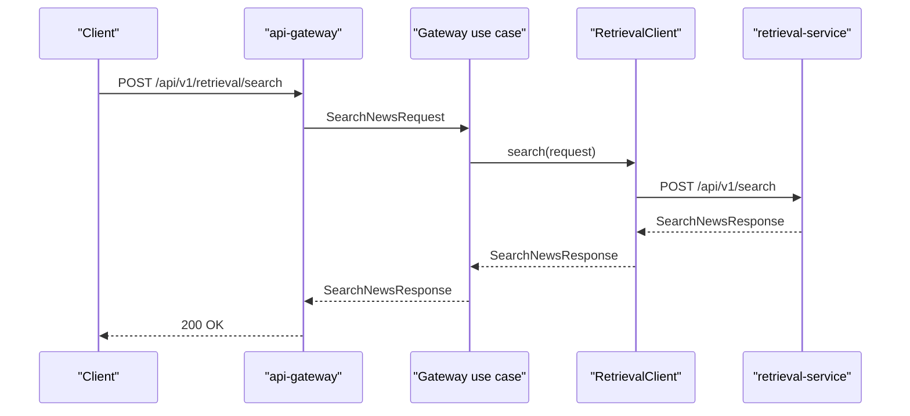

# Интеграция API Gateway с Retrieval Service

Дата: 2026-04-29

## Цель

Подключить `api-gateway` к `retrieval-service`, чтобы внешний клиент мог индексировать и искать экономические новости через единый пользовательский API. Gateway остается тонким фасадом и не содержит логики embeddings, Qdrant или ранжирования.

## Контекст

В проекте уже есть:

- `analysis-service` для анализа влияния новости;
- `retrieval-service` для семантического поиска через FastEmbed и Qdrant;
- `api-gateway`, который уже проксирует `POST /api/v1/analyze` в `analysis-service`;
- общие retrieval-контракты в `economic_news_contracts.retrieval`;
- Zapros как выбранный HTTP client framework для межсервисных вызовов.

Следующий шаг должен дать пользовательский путь к retrieval API через gateway без перехода к `dialog-service`, SSE или LLM-генерации.

## Выбранный подход

`api-gateway` добавляет routes:

```http
POST /api/v1/retrieval/index
POST /api/v1/retrieval/search
```

Оба endpoint используют shared contracts:

- `IndexNewsRequest`;
- `IndexNewsResponse`;
- `SearchNewsRequest`;
- `SearchNewsResponse`.

Gateway вызывает `retrieval-service` через application port `RetrievalClient`. HTTP-реализация живет в infrastructure-слое и использует Zapros, как существующий `ZaprosAnalysisClient`.

## Слои и компоненты

### Application

Добавить:

- `RetrievalClient` Protocol;
- `IndexNewsUseCase`;
- `SearchNewsUseCase`;
- `RetrievalServiceUnavailableError`.

Use cases только делегируют в `RetrievalClient`; они не знают про URL, HTTP, Zapros, Qdrant или FastAPI.

### Infrastructure

Добавить `ZaprosRetrievalClient`.

Ответственность клиента:

- отправлять `IndexNewsRequest` на `POST /api/v1/index` в `retrieval-service`;
- отправлять `SearchNewsRequest` на `POST /api/v1/search` в `retrieval-service`;
- валидировать ответы через retrieval contracts;
- маппить transport errors и `5xx` в `RetrievalServiceUnavailableError`;
- использовать timeout через актуальный API Zapros.

### Main / DI

Расширить `ApiGatewaySettings`:

- `retrieval_service_url = "http://retrieval-service:8000"`;
- `retrieval_service_timeout_seconds = 3.0`.

Так как `ApiGatewaySettings` уже использует prefix `API_GATEWAY_`, env-переменные:

- `API_GATEWAY_RETRIEVAL_SERVICE_URL`;
- `API_GATEWAY_RETRIEVAL_SERVICE_TIMEOUT_SECONDS`.

Через Dishka зарегистрировать:

- `RetrievalClient`;
- `IndexNewsUseCase`;
- `SearchNewsUseCase`.

### Presentation

Добавить retrieval routes в существующий router `prefix="/api/v1"`:

```http
POST /retrieval/index
POST /retrieval/search
```

При недоступности retrieval-сервиса возвращать:

```http
503 Service Unavailable
```

с публичным `detail = "retrieval-service is unavailable"`.

Ошибки Pydantic validation остаются стандартными `422`.

### Deploy

В `deploy/compose.yaml` для `api-gateway` добавить:

```yaml
API_GATEWAY_RETRIEVAL_SERVICE_URL: "http://retrieval-service:8000"
```

и dependency:

```yaml
- retrieval-service
```

## Поток данных



Indexing follows the same shape with `IndexNewsRequest` and `POST /api/v1/index`.

## Ошибки

Gateway does not reinterpret retrieval business data. It preserves successful retrieval responses exactly as contracts define them.

Gateway hides technical interservice failures. Network errors, timeouts and downstream `5xx` become `RetrievalServiceUnavailableError` and public `503`.

Gateway does not catch validation errors from invalid client payloads; FastAPI/Pydantic returns `422`.

## Тестирование

Покрыть:

- application use cases with fake `RetrievalClient`;
- Zapros retrieval client for index/search success;
- Zapros retrieval client maps transport errors and `5xx`;
- API routes success for index/search with fake use cases/client;
- API route maps unavailable retrieval service to `503`;
- settings read `API_GATEWAY_RETRIEVAL_SERVICE_URL`;
- container resolves retrieval use cases;
- compose config contains retrieval env and dependency.

Перед PR должны проходить:

```bash
uv run ruff check apps packages research
uv run ty check apps packages research
uv run pytest packages apps research/tests -v -W error
docker compose -f deploy/compose.yaml config
docker compose -f deploy/compose.yaml build api-gateway
```

## Границы текущего шага

В этот шаг не входят:

- `dialog-service`;
- LLM prompt orchestration;
- SSE streaming;
- React UI;
- Taskiq/FastStream background indexing;
- live end-to-end test with real Qdrant model download.

Этот шаг только делает retrieval-service доступным через `api-gateway`.
