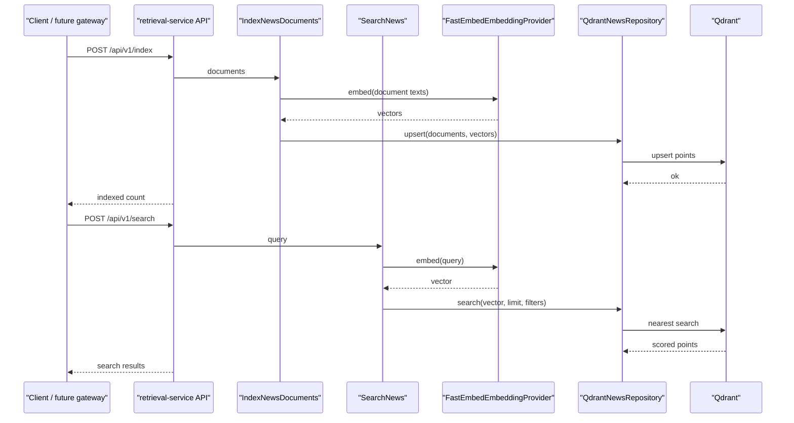

# Retrieval Service

Дата: 2026-04-29

## Цель

Добавить отдельный микросервис семантического поиска по экономическим новостям. Сервис должен индексировать новости в Qdrant и возвращать релевантные документы по текстовому запросу, чтобы последующий `dialog-service` мог строить ответы на основе найденного контекста.

## Контекст

В проекте уже есть:

- `api-gateway` с пользовательским endpoint анализа новости;
- `analysis-service` для классификации влияния новости;
- общий пакет `packages/contracts`;
- общий пакет `packages/framework`;
- Docker Compose с Qdrant.

Следующий шаг должен добавить retrieval-слой без смешивания логики поиска с gateway или analysis-сервисом. Архитектура остается микросервисной, слоистой и DDD-oriented: бизнес-сценарии живут в application-слое, внешние клиенты в infrastructure-слое, HTTP API в presentation-слое.

## Выбранный подход

`retrieval-service` будет отдельным FastAPI/Granian сервисом с Dishka DI, Qdrant как vector store и FastEmbed как легкий локальный embedding provider.

Embedding model по умолчанию:

```text
sentence-transformers/paraphrase-multilingual-MiniLM-L12-v2
```

Причины выбора:

- поддерживает русский и английский тексты;
- имеет малый размер для локального запуска;
- использует ONNX/FastEmbed и не требует тяжелого PyTorch runtime;
- дает 384-мерные embeddings, что достаточно для курсового semantic search;
- хорошо ложится на Qdrant.

## Контракты

В `packages/contracts` добавляются модели retrieval API.

### NewsDocumentPayload

Документ новости для индексации:

- `id`: стабильный идентификатор новости;
- `title`: заголовок;
- `text`: основной текст;
- `source`: источник;
- `published_at`: опциональная дата публикации ISO-формата;
- `metadata`: произвольные публичные дополнительные поля.

### IndexNewsRequest / IndexNewsResponse

`IndexNewsRequest` содержит список документов. Сервис возвращает количество успешно принятых документов и имя коллекции.

### SearchNewsRequest / SearchNewsResponse

`SearchNewsRequest` содержит:

- `query`: текстовый поисковый запрос;
- `limit`: количество результатов, по умолчанию 5;
- `source`: опциональный фильтр по источнику.

`SearchNewsResponse` возвращает список результатов:

- `id`;
- `score`;
- `title`;
- `text`;
- `source`;
- `published_at`;
- `metadata`.

## Слои сервиса

### Domain

Domain-слой содержит:

- `NewsDocument`;
- `SearchQuery`;
- `SearchResult`;
- domain-валидацию пустых текстов и некорректного `limit`.

Domain-слой не знает про Qdrant, FastEmbed, HTTP или Pydantic.

### Application

Application-слой содержит Protocol-интерфейсы:

- `EmbeddingProvider`: строит embeddings для списка текстов;
- `VectorRepository`: сохраняет документы и выполняет поиск.

Use cases:

- `IndexNewsDocuments`: нормализует входные документы, строит embeddings и сохраняет их;
- `SearchNews`: строит embedding запроса и ищет ближайшие новости.

Use cases работают только через Protocol и domain-модели.

### Infrastructure

Infrastructure-слой содержит:

- `FastEmbedEmbeddingProvider`;
- `QdrantNewsRepository`;
- преобразование domain-моделей в Qdrant points и обратно.

Qdrant collection создается лениво при первом индексировании или поиске, если она отсутствует. Размерность вектора берется из настроек и по умолчанию равна `384`.

### Presentation

HTTP API:

```http
POST /api/v1/index
POST /api/v1/search
```

Presentation-слой использует контракты из `packages/contracts` и вызывает application use cases через Dishka.

## Настройки

`RetrievalServiceSettings` использует prefix `RETRIEVAL_`.

Поля:

- `service_name = "retrieval-service"`;
- `version = "0.1.0"`;
- `qdrant_url = "http://qdrant:6333"`;
- `collection_name = "economic_news"`;
- `embedding_model_name = "sentence-transformers/paraphrase-multilingual-MiniLM-L12-v2"`;
- `embedding_dimension = 384`.

## Docker Compose

В `deploy/compose.yaml` добавляется `retrieval-service`:

- build context текущего monorepo;
- Dockerfile `deploy/docker/retrieval-service.Dockerfile`;
- env file `.env.example`;
- `RETRIEVAL_QDRANT_URL=http://qdrant:6333`;
- port `8002:8000`;
- dependency `qdrant`.

`qdrant` остается общим инфраструктурным сервисом.

## Поток данных



## Ошибки

Пустые документы, пустой поисковый запрос и некорректный `limit` возвращаются как ошибки валидации.

Недоступность Qdrant или embedding provider превращается в `503 Service Unavailable` с нейтральным публичным сообщением. Детали технической ошибки остаются в логах.

## Тестирование

Покрыть:

- contracts validation;
- domain-модели и ошибки;
- use cases с fake embedding provider и fake vector repository;
- HTTP API с fake use cases / fake providers;
- infrastructure mapping через fake Qdrant client без реального контейнера;
- settings и Dishka container.

Перед PR должны проходить:

```bash
uv run ruff check apps packages research
uv run ty check apps packages research
uv run pytest packages apps research/tests -v -W error
docker compose -f deploy/compose.yaml build retrieval-service
```

## Границы текущего шага

В этот шаг не входят:

- интеграция retrieval-service в `api-gateway`;
- SSE;
- `dialog-service`;
- генерация LLM-ответов;
- Taskiq/FastStream фоновая индексация;
- React UI.

Эти части логично добавлять после того, как отдельный retrieval-service будет иметь стабильные контракты, API и Docker-запуск.
