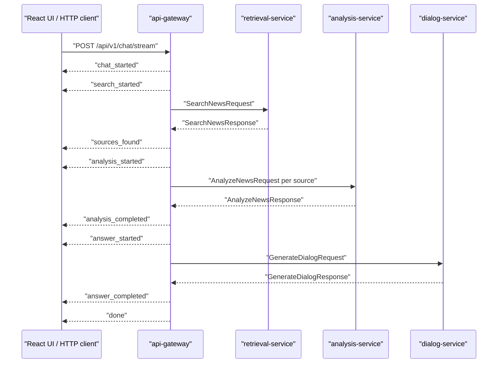

# API Gateway Chat SSE Design

## Goal

Add a lightweight Server-Sent Events endpoint to `api-gateway` so the chat pipeline can report progress to a future React UI while keeping the existing non-streaming `/api/v1/chat` endpoint unchanged.

The slice should demonstrate the full economic-news dialog pipeline:

1. Search relevant news in `retrieval-service`.
2. Analyze retrieved news in `analysis-service`.
3. Generate the final answer through `dialog-service`.
4. Stream pipeline milestones as SSE events.

This is pipeline-progress streaming, not token-by-token LLM streaming. Token streaming is intentionally deferred because the current `dialog-service` contract returns one completed answer.

## Scope

In scope:

- add `POST /api/v1/chat/stream`;
- keep request body equal to `ChatRequest`;
- emit deterministic SSE events for each pipeline stage;
- reuse existing `ChatUseCase` orchestration logic where practical;
- keep DDD/layered boundaries: application code describes events, presentation code formats SSE;
- map downstream service failures to one SSE `error` event and close the stream;
- add focused tests for event order, payload shape and failure mapping.

Out of scope:

- React UI;
- browser EventSource workaround for POST requests;
- token-by-token LLM output;
- background jobs, Taskiq or FastStream;
- Redis persistence;
- authentication;
- changing the existing `/api/v1/chat` response.

## API Contract

Endpoint:

```text
POST /api/v1/chat/stream
Content-Type: application/json
Accept: text/event-stream
```

Request:

```json
{
  "question": "Что значит рост ВВП для рынка?",
  "analysis_model": "tfidf-logreg",
  "limit": 5,
  "source": null
}
```

Response media type:

```text
text/event-stream
```

Each SSE message uses the standard form:

```text
event: <event_name>
data: <json_object>

```

## Event Sequence

Successful stream:

```text
chat_started
search_started
sources_found
analysis_started
analysis_completed
answer_started
answer_completed
done
```

The endpoint should emit events in that order. `analysis_started` and `analysis_completed` are emitted once for the analysis stage, not once per source, to keep the first UI simple and avoid noisy implementation code.

### `chat_started`

```json
{
  "question": "Что значит рост ВВП для рынка?",
  "analysis_model": "tfidf-logreg",
  "limit": 5,
  "source": null
}
```

### `search_started`

```json
{
  "query": "Что значит рост ВВП для рынка?",
  "limit": 5,
  "source": null
}
```

### `sources_found`

```json
{
  "count": 2,
  "sources": [
    {
      "id": "news-1",
      "title": "GDP grows",
      "source": "demo",
      "score": 0.87,
      "published_at": null,
      "metadata": {}
    }
  ]
}
```

This event intentionally omits full news text. Full text remains available in the final `answer_completed` event through the existing `ChatResponse.sources` payload.

### `analysis_started`

```json
{
  "count": 2,
  "analysis_model": "tfidf-logreg"
}
```

### `analysis_completed`

```json
{
  "count": 2,
  "impact_summaries": [
    {
      "news_id": "news-1",
      "model_name": "tfidf-logreg",
      "impact": "positive",
      "confidence": 0.82,
      "explanation": "Рост ВВП обычно поддерживает рынок."
    }
  ]
}
```

### `answer_started`

```json
{
  "context_count": 2,
  "impact_summary_count": 2
}
```

### `answer_completed`

Data is the existing `ChatResponse` JSON:

```json
{
  "answer": "Рост ВВП обычно является позитивным сигналом...",
  "sources": [],
  "impact_summaries": [],
  "analysis_model": "tfidf-logreg",
  "metadata": {
    "dialog_model_name": "Qwen3-0.6B-Instruct-GGUF",
    "used_context_ids": ["news-1"]
  }
}
```

### `done`

```json
{
  "status": "ok"
}
```

## Error Contract

If a downstream service fails after the HTTP stream has started, the endpoint emits one `error` event and closes the stream.

```text
event: error
data: {"stage":"analysis","detail":"analysis-service is unavailable"}

```

Stage values:

- `retrieval`;
- `analysis`;
- `dialog`;
- `unknown`.

The streamed error detail must match the existing HTTP error details:

- `analysis-service is unavailable`;
- `retrieval-service is unavailable`;
- `dialog-service is unavailable`.

The endpoint should not expose transport details, stack traces, URLs, exception class names or internal payloads.

## Architecture

Add a small event model in `api_gateway.application`:

- `ChatStreamEvent`: immutable dataclass with `event` and `data`;
- `ChatStreamUseCase`: orchestrates the same clients as `ChatUseCase` and yields `ChatStreamEvent` objects.

`ChatUseCase` remains the stable non-streaming use case. Shared helper methods may be extracted inside `application/use_cases.py` only if they reduce duplication without creating unused abstractions.

Presentation owns SSE formatting:

- `api_gateway.presentation.sse` formats event name and JSON data into bytes or strings;
- `router.py` returns `StreamingResponse` with media type `text/event-stream`.

This keeps application logic independent from FastAPI response mechanics.

## Data Flow



## Testing

Required tests:

- contract-level validation of any new stream event DTOs if added to `packages/contracts`;
- application tests for successful event order and payloads;
- application tests for retrieval, analysis and dialog failures;
- presentation tests that verify:
  - status `200`;
  - `text/event-stream` media type;
  - event lines are formatted as `event: ...` and `data: ...`;
  - the existing `/api/v1/chat` endpoint still returns `ChatResponse`.

## Verification

Run:

```bash
uv run ruff check apps packages research
uv run ty check apps packages research
uv run pytest packages apps research/tests -v -W error
docker compose -f deploy/compose.yaml config
```

Docker build is desirable if Docker daemon is available:

```bash
docker compose -f deploy/compose.yaml build api-gateway
```

## Coursework Fit

This slice directly supports section `4.4. Реализация API, SSE и пользовательского интерфейса` of the coursework structure. It also improves the presentation demo: the system can show not only the final answer but the internal analytical stages of the microservice pipeline.
