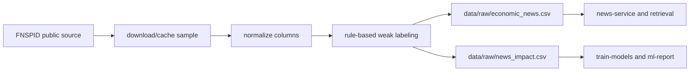

# FNSPID Importer Design

## Цель

Добавить воспроизводимую подготовку FNSPID без ручного скачивания файла. Команда должна сама получить ограниченный срез датасета, привести его к схемам проекта и подготовить данные для retrieval, обучения трех классификаторов и ML-отчета.

В этой фазе реализуется только importer и weak labeling. Тематическое объединение новостей и прогноз по группе новостей фиксируются как следующий отдельный этап, чтобы не раздувать текущую итерацию.

## Scope

Входит в текущую итерацию:

- команда `just prepare-fnspid`;
- отдельная CLI-команда в `tools/prepare_fnspid.py`, которая переиспользует общие нормализаторы из `tools/prepare_dataset.py`, где это уместно;
- загрузка FNSPID news data из публичного источника;
- ограничение размера среза по умолчанию;
- нормализация колонок в `data/raw/economic_news.csv`;
- формирование `data/raw/news_impact.csv`;
- weak labeling `positive | neutral | negative` по тексту новости;
- документация запуска и ограничений.

Не входит в текущую итерацию:

- полная загрузка всего FNSPID как обязательный сценарий;
- обучение моделей внутри importer;
- topic clustering;
- прогноз по объединенной теме;
- UI для настройки импорта.

## Источник данных

Основной источник - FNSPID: Financial News and Stock Price Integration Dataset.

Importer должен работать с ограниченным news-срезом по умолчанию, потому что полный FNSPID слишком тяжелый для обычного запуска на ноутбуке. Базовый сценарий:

- потоково скачать FNSPID news CSV из публичного источника и остановиться после нужного числа валидных строк;
- взять первые `N` валидных строк после фильтрации, где `N` по умолчанию равно `50000`;
- сохранить исходный подготовленный срез в `data/external/fnspid_sample.csv`;
- не коммитить скачанные данные в git.

Источник по умолчанию:

```text
https://huggingface.co/datasets/Zihan1004/FNSPID/resolve/main/Stock_news/nasdaq_exteral_data.csv
```

Если внешний источник недоступен, команда должна завершиться понятной ошибкой с инструкцией, куда положить локальный CSV и какой командой повторить подготовку. Внутренние stack traces не должны быть основным пользовательским сообщением.

## Нормализация

Importer приводит данные к двум выходам.

`data/raw/economic_news.csv` используется приложением, news-service и retrieval:

```csv
article_id,title,text,source,published_at
```

`data/raw/news_impact.csv` используется research pipeline:

```csv
article_id,text,impact,source,published_at
```

Нормализация должна:

- удалить строки без текста;
- привести даты к ISO-совместимому виду, если дата доступна;
- заполнить `source` значением из датасета или `FNSPID`;
- сформировать стабильный `article_id`, если в источнике нет подходящего идентификатора;
- ограничить длину текста разумным пределом, если строка слишком большая для обучения и индексации.

## Weak Labeling

Для обучения классификатора нужен label `impact`. В этой итерации используется weak labeling по тексту:

- быстрый, воспроизводимый rule-based режим включен по умолчанию;
- опциональный LLM-labeling можно заложить в интерфейс CLI, но не делать обязательным для успешного запуска;
- результат всегда приводится к `positive`, `neutral` или `negative`.

Rule-based labeling должен учитывать экономические маркеры:

- `positive`: рост, прибыль, превышение ожиданий, снижение инфляционного давления, улучшение прогнозов, расширение производства;
- `negative`: падение, убыток, сокращение, рост инфляции, повышение рисков, снижение спроса, рецессия;
- `neutral`: информационные сообщения без явного направления или конфликтующие сигналы.

Если сигналы конфликтуют, importer выбирает `neutral`. Это лучше для качества курсового демо, чем агрессивно размечать спорные новости.

В метаданных подготовки нужно вывести распределение классов, чтобы пользователь сразу видел, пригоден ли срез для обучения.

## CLI

Основная команда:

```bash
just prepare-fnspid
```

Ожидаемые параметры CLI под капотом:

- `--limit`, default `50000`;
- `--output-news`, default `data/raw/economic_news.csv`;
- `--output-training`, default `data/raw/news_impact.csv`;
- `--cache-path`, default `data/external/fnspid_sample.csv`;
- `--source-url`, default на публичный FNSPID news CSV;
- `--labeling-mode`, default `rules`.

Дополнительный сценарий для уже скачанного файла:

```bash
just prepare-fnspid-local path/to/fnspid.csv
```

Этот fallback нужен для защиты и офлайн-режима.

## Data Flow



## Error Handling

Importer должен явно различать ошибки:

- источник недоступен;
- CSV не содержит нужных текстовых колонок;
- после фильтрации не осталось строк;
- weak labeling дал слишком перекошенное распределение классов;
- не удалось записать выходные файлы.

Для перекошенного распределения классов команда не должна падать по умолчанию, но должна печатать предупреждение. Жесткая остановка возможна отдельным параметром в будущем.

## Документация

Нужно обновить:

- `docs/deployment/model-modes-and-large-datasets.md`;
- `docs/demo.md`;
- `research/README.md`;
- при необходимости `docs/coursework/thesis-draft.md`.

В документации важно объяснить, что FNSPID importer автоматизирует подготовку данных, а не подменяет экономическую методологию. Weak labels являются приближенной разметкой для учебного pipeline.

## Следующий Этап: Тематический Прогноз

Следующая отдельная фаза должна сделать экономический анализ интереснее:

- объединять похожие новости в тему;
- строить краткое резюме темы;
- агрегировать impact сигнал по нескольким новостям;
- формировать осторожный прогноз направления: положительное, нейтральное или отрицательное влияние;
- показывать аргументы, confidence и disclaimer.

Эта фаза должна использовать подготовленные FNSPID данные и существующий retrieval/RAG pipeline, но не входит в реализацию importer.

## Проверка

Минимальная проверка реализации:

- unit tests для загрузки и нормализации FNSPID-like CSV;
- unit tests для rule-based weak labeling;
- CLI test на запись `economic_news.csv` и `news_impact.csv`;
- проверка `just prepare-fnspid-local` на fixture;
- smoke: `just prepare-fnspid-local fixture && just ml-report`;
- документация без generic `external.csv` / `sentiment` в FNSPID-сценарии.
